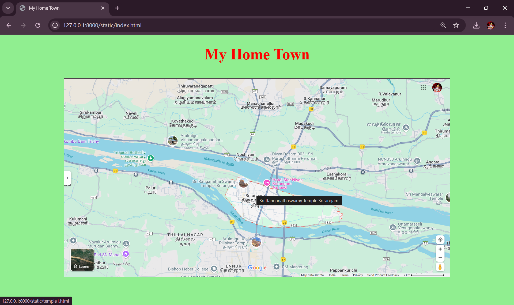
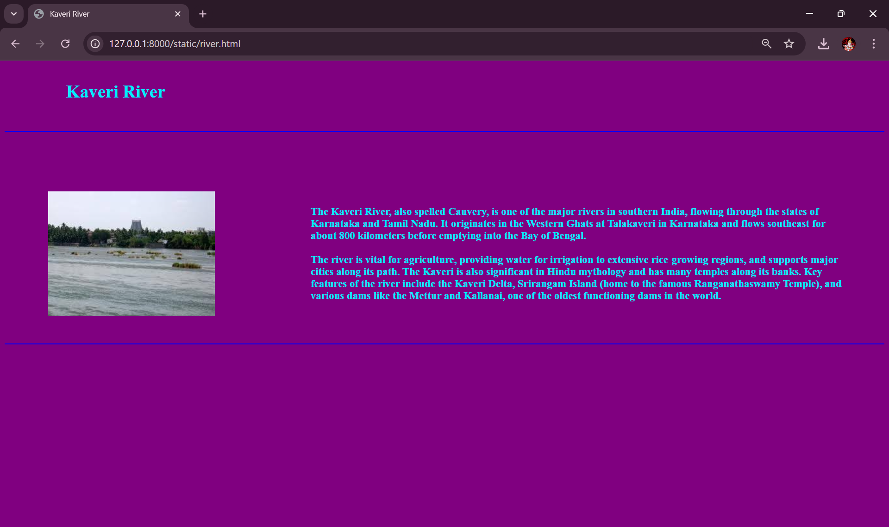

# Ex04 Places Around Me
## Date: 17.11.2024

## AIM
To develop a website to display details about the places around my house.

## DESIGN STEPS

### STEP 1
Create a Django admin interface.

### STEP 2
Download your city map from Google.

### STEP 3
Using ```<map>``` tag name the map.

### STEP 4
Create clickable regions in the image using ```<area>``` tag.

### STEP 5
Write HTML programs for all the regions identified.

### STEP 6
Execute the programs and publish them.

## CODE
```
index.html

<!DOCTYPE html>
<html lang="en">

<head>
    <meta charset="UTF-8">
    <meta name="viewport" content="width=device-width, initial-scale=1.0">
    <title>My Home Town</title>
    <style>
        img{
            padding-top: 1%;
        }
        h1{
            text-align: center;
            font-size: 48px;
            color: red;
        }
        body{
            background-color: lightgreen;
        }
    </style>
</head>

<body>
    <h1>My Home Town</h1>
    <center></center>

    <map name="image-map">
        <area target="" alt="Sri Ranganathaswamy Temple Srirangam" title="Sri Ranganathaswamy Temple Srirangam"
            href="temple1.html" coords="824,445,352,123" shape="">
        <area target="" alt="Rockfort" title="Rockfort" href="temple2.html" coords="754,795,989,912" shape="rect">
        <area target="" alt="Butterfly Park" title="Butterfly Park" href="park.html" coords="211,365,488,449"
            shape="rect">
        <area target="" alt="Samayapuram Maariyamman Temple" title="Samayapuram Maariyamman Temple" href="temple3.html"
            coords="1265,23,1410,107" shape="rect">
        <area target="" alt="Kaveri river" title="Kaveri river" href="river.html"
            coords="808,626,771,666,896,776,937,746" shape="poly">
    </map>
</body>

</html>

temple1.html

<!DOCTYPE html>
<html lang="en">

<head>
    <meta charset="UTF-8">
    <meta name="viewport" content="width=device-width, initial-scale=1.0">
    <title>Sri Ranganathaswamy Temple Srirangam</title>
    <style>
        h1 {
            color: red;
            margin-left: 7%;
            padding-top: 1%;
            padding-bottom: 2%;
        }

        img {
            padding-top: 19%;
            padding-left: 15%;
            width: 300px;
        }

        .container {
            display: grid;
            align-items: center;
            grid-template-columns: 0.5fr 1fr 0;
            column-gap: 7px;
        }

        .p {
            padding-top: 9%;
            font-size: 19px;
            padding-right: 5%;
            padding-left: 2%;
            color: red;
        }

        body {
            background-color: yellow;
        }
    </style>
</head>

<body>
    <h1>Sri Ranganathaswamy Temple Srirangam</h1>
    <hr color="black">
    <div class="container">
        <div class="img">
            
        </div>
        <div class="p">
            <p><b>The Srirangam Temple, or Sri Ranganathaswamy Temple, is a major Hindu temple in Srirangam,
                    Tiruchirapalli, Tamil Nadu, dedicated to Lord Ranganatha (a form of Vishnu). It is the largest
                    functioning Hindu temple complex in the world, covering 156 acres and featuring impressive Dravidian
                    architecture, including tall gateway towers (gopurams). The tallest tower, Raja Gopuram, stands 73
                    meters high.
                    <br><br>
                    The temple has a long history and is celebrated in Tamil poetry by the Alvar saints. It hosts a
                    21-day festival in December-January, drawing millions of visitors. In 2017, it won a UNESCO award
                    for heritage conservation and is also on UNESCO’s tentative World Heritage Site list for its
                    cultural and historical value.</b></p>
        </div>
    </div>
    <br><br>
    <hr color="black">

</body>

</html>


temple2.html

<!DOCTYPE html>
<html lang="en">

<head>
    <meta charset="UTF-8">
    <meta name="viewport" content="width=device-width, initial-scale=1.0">
    <title>Tiruchirapalli Rockfort Temple</title>
    <style>
        h1 {
            color: brown;
            margin-left: 7%;
            padding-top: 1%;
            padding-bottom: 2%;
        }

        img {
            padding-top: 19%;
            padding-left: 15%;
            width: 410px;
        }

        .container {
            display: grid;
            align-items: center;
            grid-template-columns: 0.5fr 1fr 0;
            column-gap: 7px;
        }

        .p {
            padding-top: 9%;
            font-size: 19px;
            padding-right: 6%;
            padding-left: 8%;
            color: brown;
        }

        body {
            background-color: rgb(124, 149, 253);
        }
    </style>
</head>

<body>
    <h1>Tiruchirapalli Rockfort Temple</h1>
    <hr color="black">
    <div class="container">
        <div class="img">
            
        </div>
        <div class="p">
            <p><b>
                The Rockfort Temple in Tiruchirapalli (Trichy), Tamil Nadu, is a historic Hindu temple complex built on
                a massive rock that rises 83 meters (273 feet) above the surrounding landscape. This ancient rock
                formation, over a billion years old, houses two main temples: the Ucchi Pillayar Temple at the top,
                dedicated to Lord Ganesha, and the Thayumanavar Temple, dedicated to Lord Shiva, halfway up.
                    <br><br>
                The temple is famous for its steep climb of 417 steps, carved into the rock, which offers breathtaking
                panoramic views of Trichy city and the nearby Kaveri River. The Rockfort Temple is especially busy
                during festivals like Vinayaka Chaturthi, attracting pilgrims and tourists alike. It is celebrated not
                only for its religious significance but also for its architectural marvel, blending Dravidian temple
                architecture with natural rock formations.</b>
            </p>
        </div>
    </div>
    <br><br>
        <hr color="black">

</body>

</html>


temple3.html

<!DOCTYPE html>
<html lang="en">

<head>
    <meta charset="UTF-8">
    <meta name="viewport" content="width=device-width, initial-scale=1.0">
    <title>Samayapuram Maariyamman Temple</title>
    <style>
        h1 {
            color: rgb(34, 143, 252);
            margin-left: 7%;
            padding-top: 1%;
            padding-bottom: 2%;
        }

        img {
            padding-top: 19%;
            padding-left: 30%;
            height: 280px;
        }

        .container {
            display: grid;
            align-items: center;
            grid-template-columns: 0.5fr 1fr 0;
            column-gap: 2px;
        }

        .p {
            padding-top: 9%;
            font-size: 19px;
            padding-right: 5%;
            color: rgb(34, 143, 252);
        }

        body {
            background-color: rgb(62, 234, 46);
        }
    </style>
</head>

<body>
    <h1>Samayapuram Maariyamman Temple</h1>
    <hr color="black">
    <div class="container">
        <div class="img">
            
        </div>
        <div class="p">
            <p>
                <b>The Samayapuram Mariamman Temple is a prominent Hindu temple located in Samayapuram, near Tiruchirapalli,
                Tamil Nadu, India. It is dedicated to Mariamman, a powerful goddess associated with health, rain, and
                fertility, often revered as a form of Shakti. The temple is one of the most famous centers of Mariamman
                worship in Tamil Nadu. <br><br>

                A major annual event at the temple is the Poochorithal festival, which typically occurs in March or
                April and draws thousands of devotees. During the festival, people offer flowers, turmeric, and neem
                leaves to the goddess, praying for protection and healing. Devotees visit year-round, seeking blessings
                for various needs, from health recovery to personal prosperity. The temple is known for its lively,
                vibrant atmosphere and unique rituals, including fire-walking and self-offering of small silver body
                parts as vows for healing.</b></p>
        </div>
    </div>
    <br><br>
    <hr color="black">
</body>

</html>


park.html

<!DOCTYPE html>
<html lang="en">

<head>
    <meta charset="UTF-8">
    <meta name="viewport" content="width=device-width, initial-scale=1.0">
    <title>Tropical Butterfly Conservatory Srirangam</title>
    <style>
        h1 {
            color: rgb(255, 72, 0);
            margin-left: 7%;
            padding-top: 1%;
            padding-bottom: 2%;
        }

        img {
            padding-top: 19%;
            padding-left: 15%;
            width: 410px;
        }

        .container {
            display: grid;
            align-items: center;
            grid-template-columns: 0.5fr 1fr 0;
            column-gap: 7px;
        }

        .p {
            padding-top: 9%;
            font-size: 19px;
            padding-right: 6%;
            padding-left: 8%;
            color: rgb(255, 72, 0);
        }

        body {
            background-color: rgb(116, 244, 154);
        }
    </style>
</head>

<body>
    <h1>Tropical Butterfly Conservatory Srirangam</h1>
    <hr color="black">
    <div class="container">
        <div class="img">
            
        </div>
        <div class="p">
            <p>
               <b>The Butterfly Park in Srirangam, Tiruchirapalli (Trichy), Tamil Nadu, is a popular eco-tourism
                attraction and one of India’s largest butterfly parks. Spanning around 35 acres, it is designed to
                conserve and showcase various butterfly species in a natural, lush environment. The park houses over 100
                species of butterflies, along with diverse flowering plants, shrubs, and trees that create an ideal
                habitat for them.
                <br><br>
                In addition to butterfly enclosures, the park includes educational and recreational features like
                gardens, walking trails, a children’s play area, and a small artificial waterfall. The park also offers
                educational programs about butterfly life cycles, conservation efforts, and biodiversity, making it a
                great spot for nature lovers, families, and students. It provides a peaceful escape, encouraging
                visitors to explore and appreciate the beauty of these delicate, vibrant creatures.</b>
            </p>
        </div>
    </div>
    <br><br>
    <hr color="black">

</body>

</html>


river.html

<!DOCTYPE html>
<html lang="en">

<head>
    <meta charset="UTF-8">
    <meta name="viewport" content="width=device-width, initial-scale=1.0">
    <title>Kaveri River</title>
    <style>
        h1 {
            color: rgb(0, 238, 255);
            margin-left: 7%;
            padding-top: 1%;
            padding-bottom: 2%;
        }

        img {
            padding-top: 19%;
            padding-left: 15%;
            width: 300px;
        }

        .container {
            display: grid;
            align-items: center;
            grid-template-columns: 0.5fr 1fr 0;
            column-gap: 7px;
        }

        .p {
            padding-top: 9%;
            font-size: 19px;
            padding-right: 5%;
            padding-left: 2%;
            color: rgb(0, 238, 255);
        }

        body {
            background-color: purple;
        }
    </style>
</head>

<body>
    <h1>Kaveri River</h1>
    <hr color="blue">
    <div class="container">
        <div class="img">
            
        </div>
        <div class="p">
            <p><b>The Kaveri River, also spelled Cauvery, is one of the major rivers in southern India, flowing through
                    the states of Karnataka and Tamil Nadu. It originates in the Western Ghats at Talakaveri in
                    Karnataka and flows southeast for about 800 kilometers before emptying into the Bay of Bengal.
                    <br><br>
                    The river is vital for agriculture, providing water for irrigation to extensive rice-growing
                    regions, and supports major cities along its path. The Kaveri is also significant in Hindu mythology
                    and has many temples along its banks. Key features of the river include the Kaveri Delta, Srirangam
                    Island (home to the famous Ranganathaswamy Temple), and various dams like the Mettur and Kallanai,
                    one of the oldest functioning dams in the world.</b></p>
        </div>
    </div>
    <br><br>
    <hr color="blue">

</body>

</html>

```

## OUTPUT





## RESULT
The program for implementing image maps using HTML is executed successfully.
